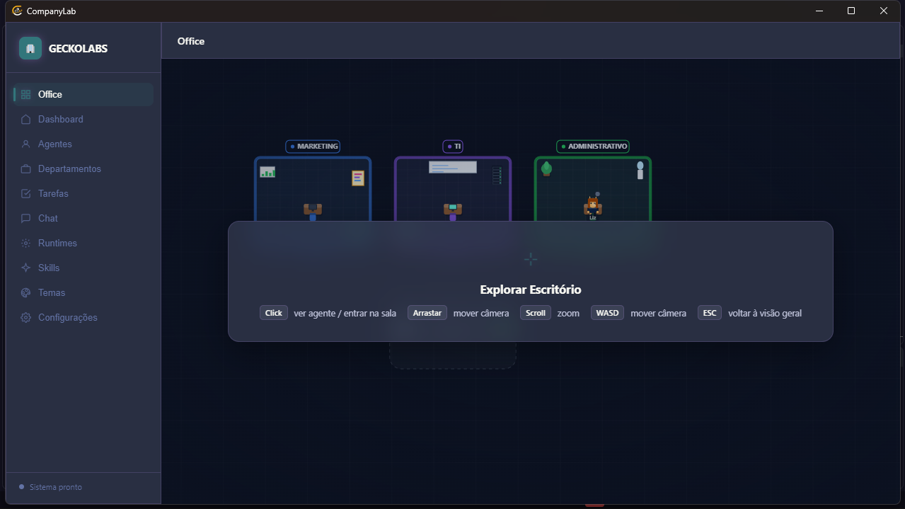
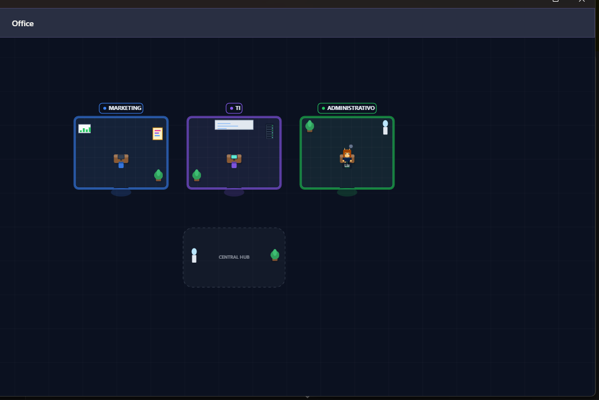
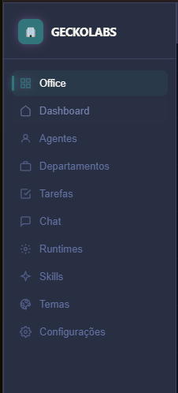

# CompanyLab 🏢

### A virtual AI company where real agents work together.

**CompanyLab** is a desktop AI workspace that turns your company into an interactive 2D office.

Create departments, hire AI agents, assign them roles, connect them to real agent runtimes, organize tasks, communicate with your team, and watch your AI company operate inside a virtual office.

Agents are not just visual characters — they can run real workloads through the AI runtimes you already use, including **OpenCode, Claude Code, and Codex**.

<p align="center">
  
</p>

---

## ✨ Features

* 🏢 **Interactive 2D Office** — explore your company through a virtual office with departments, rooms, agents and interactive elements.

* 🤖 **Real AI Agents** — create personalized agents and connect them to supported AI runtimes.

* 🧑‍💻 **Multiple Agent Runtimes** — use the CLI agent runtime that best fits each employee, including OpenCode, Claude Code and Codex.

* 🏬 **Departments** — create departments and organize agents into dedicated rooms and teams.

* 🧠 **Agent Personalities** — customize an agent's name, avatar, role, behavior, instructions and identity.

* 💬 **Company Chat** — communicate with the whole company or directly mention individual agents.

* 📋 **Task Management** — create, assign and track tasks through pending, active and completed states.

* 📊 **Dashboard** — monitor company activity, agents, departments, tasks and runtime status.

* ⚙️ **Runtime Detection** — automatically detect supported agent CLIs installed on your machine.

* 🧩 **Skills System** — manage `SKILL.md` skills and install them globally into supported agent runtimes.

* 🎨 **Themes** — choose from multiple complete interface themes.

* 🏷️ **Company Customization** — customize your company name, logo/emoji and accent color.

<p align="center">
  
</p>

---

## 🧠 How CompanyLab Works

CompanyLab separates the **visual company environment** from the **actual AI execution layer**.

```text
                         ┌─────────────────────┐
                         │     CompanyLab       │
                         │    Desktop App       │
                         └──────────┬──────────┘
                                    │
              ┌─────────────────────┼─────────────────────┐
              │                     │                     │
              ▼                     ▼                     ▼
        ┌───────────┐        ┌────────────┐        ┌────────────┐
        │  Agents   │        │ Departments│        │   Tasks    │
        └─────┬─────┘        └────────────┘        └────────────┘
              │
              ▼
        ┌──────────────────────────────────────┐
        │           Agent Runtime Layer        │
        ├──────────────┬──────────────┬────────┤
        │   OpenCode   │ Claude Code  │ Codex  │
        └──────────────┴──────────────┴────────┘
              │
              ▼
        ┌──────────────────────────────────────┐
        │             AI Models                │
        │ Hosted • Local • Custom Providers    │
        └──────────────────────────────────────┘
```

This means CompanyLab does not need to be tied to a single AI model or provider.

An agent can use the runtime and model configuration that makes sense for its role.

For example:

```text
Company
│
├── Marketing
│   ├── Haru
│   └── Kyuu
│
├── Technology
│   ├── Legoshi
│   └── Juno
│
├── Administration
│   └── Louis
│
└── Management
    └── CEO Agent
```

---

## 🖥️ Requirements

### Runtime

* **Node.js 18+**
* **npm**
* Electron-compatible desktop environment

### Recommended

At least one supported AI agent CLI:

* [OpenCode](https://github.com/anomalyco/opencode)
* [Claude Code](https://github.com/anthropics/claude-code)
* [Codex](https://github.com/openai/codex)

CompanyLab can detect supported runtimes installed on your machine and expose them through the **Runtimes** section.

### Linux

Depending on your distribution, building native dependencies may require:

* `python3`
* `build-essential`
* C/C++ compiler toolchain

---

# 🚀 Installation

## Clone the repository

```bash
git clone <your-repository-url>

cd CompanyLab
```

## Install dependencies

```bash
npm install
```

## Start CompanyLab

```bash
npm start
```

---

## 🛠️ Development

Run the application in development mode:

```bash
npm run dev
```

Build the application for the current platform:

```bash
npm run build
```

Build the Windows installer:

```bash
npm run build:win
```

The generated Windows installer is placed inside:

```text
dist/
```

> `npm install` also runs the required Electron native dependency setup through the project's `postinstall` process.

---

# 🎛️ Application

CompanyLab is organized around a set of modules designed to represent different parts of a virtual company.

| Section         | Description                                            |
| --------------- | ------------------------------------------------------ |
| **Office**      | Interactive 2D representation of the company           |
| **Dashboard**   | Company activity, statistics and status                |
| **Agents**      | Create, configure and manage AI employees              |
| **Departments** | Organize agents into departments and rooms             |
| **Tasks**       | Create and manage company tasks                        |
| **Chat**        | Communicate with the company and individual agents     |
| **Runtimes**    | Detect and manage supported AI agent CLIs              |
| **Skills**      | Manage and install `SKILL.md` skills                   |
| **Themes**      | Customize the application's visual appearance          |
| **Settings**    | Configure company identity and application preferences |

---

# 🤖 AI Agents

Agents are the core of CompanyLab.

Each agent can have its own:

* Name
* Avatar
* Department
* Role
* Personality
* System instructions
* Behavior
* Runtime
* Model
* Skills
* Workspace configuration

An agent can therefore represent almost any role inside a company.

Examples:

```text
Developer
Software Engineer
Marketing Specialist
Graphic Designer
Data Analyst
Project Manager
Researcher
Security Analyst
Customer Support
HR Assistant
CEO
CTO
```

Agents can also be assigned to different runtimes depending on the requirements of the job.

---

# 🏢 Departments

Departments are represented as rooms inside the CompanyLab office.

Example:

```text
🏢 CompanyLab
│
├── 💻 Technology
│   ├── Development
│   ├── Security
│   └── Infrastructure
│
├── 🎨 Creative
│   ├── Design
│   ├── Animation
│   └── Video
│
├── 📢 Marketing
│   ├── Social Media
│   └── Advertising
│
└── 📊 Administration
    ├── Finance
    └── Management
```

Departments are not limited to predefined business structures.

You can create your own organization according to your workflow.

---

# 🧩 Skills

CompanyLab supports skills based on the `SKILL.md` format.

A skill provides additional instructions and capabilities to an AI agent.

Example:

```text
skills/
├── code-review/
│   └── SKILL.md
│
├── sql-optimization/
│   └── SKILL.md
│
├── marketing/
│   └── SKILL.md
│
└── technical-writing/
    └── SKILL.md
```

Skills can be:

* Installed from the built-in library
* Created manually
* Assigned to agents
* Installed into supported runtimes
* Shared across projects

The goal is to make an agent's capabilities portable instead of locking them inside CompanyLab.

---

# ⚙️ Runtimes

CompanyLab is designed to work as an orchestration layer rather than replacing the agent runtimes themselves.

Supported runtimes include:

| Runtime         | Detection | Agent Execution |
| --------------- | --------: | --------------: |
| **OpenCode**    |         ✅ |               ✅ |
| **Claude Code** |         ✅ |               ✅ |
| **Codex**       |         ✅ |               ✅ |

The runtime layer allows CompanyLab to use external agent systems while keeping the company structure, agents, tasks and visualization inside the application.

This architecture also makes it possible to add additional runtimes in the future.

---

# 🎨 Themes

CompanyLab includes multiple interface themes:

| Theme              | Style                                       |
| ------------------ | ------------------------------------------- |
| **Dark**           | Dark navy interface with blue accents       |
| **Light**          | Bright interface with white and blue tones  |
| **Dracula**        | Purple and pink on dark blue-gray           |
| **Nord**           | Arctic-inspired blue-gray palette           |
| **Solarized Dark** | Warm tones over a dark petroleum background |
| **Ocean**          | Deep teal and cyan                          |
| **Cyberpunk**      | Neon magenta and cyan                       |
| **Monokai**        | Classic developer/editor palette            |
| **Gruvbox Dark**   | Warm retro earth tones                      |

Themes affect the entire application interface, including:

* Sidebar
* Cards
* Buttons
* Dialogs
* Icons
* Panels
* Navigation

The custom company accent color can override the default accent of the selected theme.

---

# 🏗️ Architecture

CompanyLab is divided into several major layers:

```text
COMPANYLAB/
│
├── src/
│   ├── main/
│   │   ├── IPC handlers
│   │   ├── Electron lifecycle
│   │   └── application services
│   │
│   └── renderer/
│       ├── UI
│       ├── views
│       ├── components
│       └── frontend logic
│
├── backend/
│   ├── database/
│   │   ├── SQLite
│   │   └── migrations
│   │
│   ├── repositories/
│   │   ├── agents
│   │   ├── departments
│   │   ├── tasks
│   │   ├── chat
│   │   └── skills
│   │
│   └── skills/
│
├── core/
│   ├── events/
│   ├── orchestrator/
│   ├── permissions/
│   └── state/
│
├── agents/
│   ├── manager/
│   ├── factory/
│   └── sprites/
│
├── room/
│   ├── renderer/
│   ├── rooms/
│   ├── camera/
│   └── avatars/
│
├── config/
│   ├── runtimes/
│   └── company/
│
├── database/
│   └── migrations/
│
├── assets/
│   ├── icons/
│   └── models/
│
└── docs/
    └── screenshots/
```

---

# 🔌 Extensibility

CompanyLab is designed around modular components.

Future integrations can extend the system with:

* New AI runtimes
* New model providers
* Additional skills
* Custom departments
* Custom agent types
* New office environments
* Plugins
* External tools
* Automation systems

The goal is to keep CompanyLab independent from any single AI provider.

---

# 🔐 Security

AI agents can execute commands and interact with the host system depending on the runtime and permissions they receive.

Because of this:

> **Never run an untrusted agent with unrestricted access to your system.**

Always review:

* Agent instructions
* Installed skills
* Runtime permissions
* Environment variables
* API credentials
* Filesystem access
* External integrations

CompanyLab itself acts as the orchestration and visualization layer; the actual capabilities available to an agent depend on its configured runtime and environment.

---

# 📸 Screenshots

### Office

<p align="center">
  
</p>

### Office — Agent View

<p align="center">
  
</p>

### Sidebar

<p align="center">
  
</p>

---

# 🗺️ Roadmap

CompanyLab is actively evolving.

Planned areas include:

* [ ] Advanced multi-agent orchestration
* [ ] Agent-to-agent collaboration
* [ ] Agent work visualization
* [ ] More AI runtimes
* [ ] Runtime health monitoring
* [ ] Expanded skills ecosystem
* [ ] Custom office layouts
* [ ] More interactive environments
* [ ] Advanced task dependencies
* [ ] Workflow automation
* [ ] Plugin system
* [ ] Import/export of company configurations
* [ ] Remote agent execution
* [ ] Team collaboration

---

# 🤝 Contributing

Contributions are welcome.

Before submitting a pull request:

1. Fork the repository.
2. Create a feature branch.
3. Make your changes.
4. Test the application.
5. Commit your changes.
6. Open a pull request.

For larger changes, consider opening an issue first to discuss the proposed architecture or feature.

---

# 📄 License

MIT License.

See [`LICENSE`](LICENSE) for the complete license text.

---

<p align="center">

**CompanyLab**

*Build your company. Hire your agents. Let them work.*

</p>
